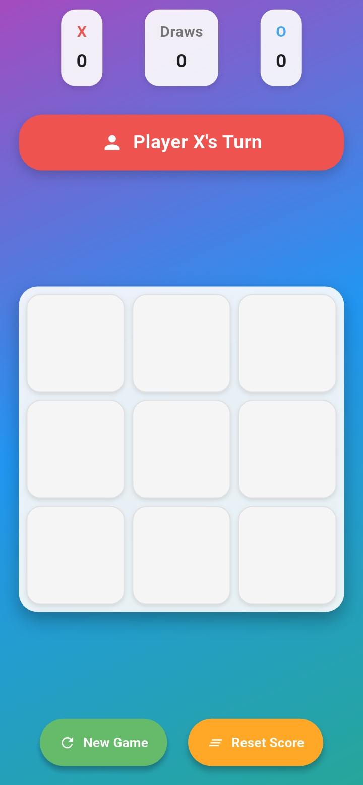
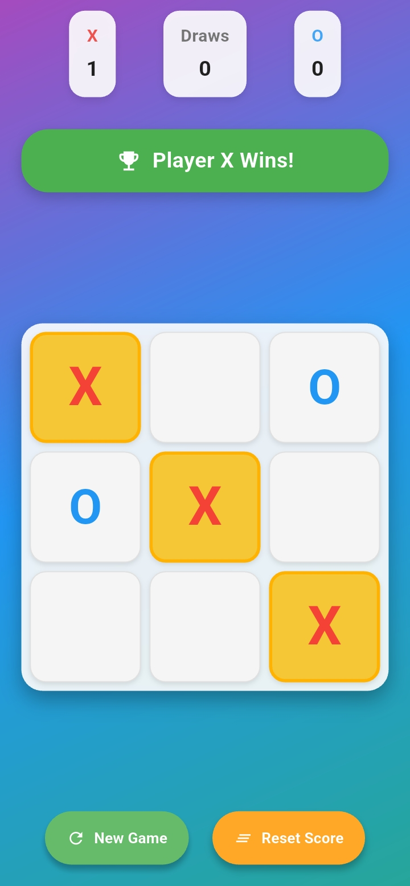

# 🎮 Tic-Tac-Toe Flutter App

<p align="center">
  
  
  
  
</p>

<p align="center">
  <strong>A beautiful, feature-rich Tic-Tac-Toe game built with Flutter</strong>
</p>

<p align="center">
  Enjoy the classic game with modern design, smooth animations, and delightful user experience on both iOS and Android devices.
</p>

---

## ✨ Features

### 🎯 Core Gameplay
- **Two-player mode** - Play with friends on the same device
- **Smart game logic** - Automatic win/draw detection
- **Intuitive controls** - Tap to place your mark
- **Turn indicators** - Always know whose turn it is

### 🎨 Beautiful Design
- **Modern UI** - Clean, card-based design with shadows and gradients
- **Responsive layout** - Looks great on all screen sizes
- **Color-coded players** - X (Red) vs O (Blue) for easy identification
- **Gradient background** - Eye-catching purple-blue-teal gradient

### 🎭 Smooth Animations
- **Cell tap animations** - Bouncy scale effects when placing marks
- **Winning highlights** - Golden pulsating effect for winning combinations
- **Smooth transitions** - Fluid state changes throughout the app
- **Visual feedback** - Immediate response to all user interactions

### 📊 Score Tracking
- **Persistent scores** - Track wins, losses, and draws during your session
- **Beautiful score cards** - Clean display of game statistics
- **Reset functionality** - Start fresh with a single tap

### 📱 Mobile Optimized
- **Haptic feedback** - Feel every move with tactile responses
- **Touch-friendly** - Large, easy-to-tap buttons and cells
- **Native performance** - Smooth 60fps animations
- **Cross-platform** - Identical experience on iOS and Android

---

## 📱 Screenshots


| Game Board | Win Animation | Score Tracking |
|------------|---------------|----------------|
|  |  | |

---

## 🚀 Getting Started

### Prerequisites

- **Flutter SDK** (3.0.0 or higher)
- **Dart** (2.17.0 or higher)
- **Android Studio** / **VS Code** with Flutter extensions
- **iOS Simulator** (for iOS testing) or **Android Emulator**

### Installation

1. **Clone the repository**
   ```bash
   git clone https://github.com/rajparihar281/Tic-Tac-Toe-Game.git
   cd tic_tac_toe_game
   ```

2. **Install dependencies**
   ```bash
   flutter pub get
   ```

3. **Run the app**
   ```bash
   flutter run
   ```

### Quick Setup for New Project

If you want to start from scratch:

1. **Create a new Flutter project**
   ```bash
   flutter create tic_tac_toe_game
   cd tic_tac_toe_game
   ```

2. **Create the folder structure**
   ```bash
   mkdir -p lib/{models,services,widgets,screens}
   ```

3. **Copy the code files** from this repository to their respective locations

4. **Run the app**
   ```bash
   flutter run
   ```

---

## 🏗️ Project Structure

```
lib/
├── main.dart                    # App entry point & theme configuration
├── models/
│   └── game_state.dart         # Game state model with immutable operations
├── services/
│   └── game_logic.dart         # Pure game logic & win detection algorithms
├── widgets/
│   ├── game_board.dart         # 3×3 grid container with animations
│   ├── game_cell.dart          # Individual interactive game cell
│   ├── score_card.dart         # Score display component
│   ├── player_status.dart      # Current player/winner indicator
│   └── control_button.dart     # Reusable styled button
└── screens/
    └── tic_tac_toe_screen.dart # Main game screen & state management
```

### Architecture Highlights

- **🎯 Separation of Concerns** - Models, services, widgets, and screens are clearly separated
- **🔄 Immutable State** - Game state is managed immutably for predictable behavior
- **🧩 Reusable Components** - Modular widgets that can be easily maintained and tested
- **🎨 Animation Management** - Centralized animation controllers for smooth UX
- **📱 Responsive Design** - Adaptive layouts that work on all device sizes

---

## 🎮 How to Play

1. **Start the Game** - Player X goes first (red color)
2. **Make Your Move** - Tap any empty cell to place your mark
3. **Take Turns** - Players alternate between X and O
4. **Win the Game** - Get three marks in a row (horizontal, vertical, or diagonal)
5. **Track Progress** - View your wins, losses, and draws at the top
6. **Play Again** - Tap "New Game" to start fresh or "Reset Score" to clear statistics

### Game Rules

- **Objective**: Be the first to get 3 of your marks in a row
- **Players**: Two players take turns (X and O)
- **Winning**: Three in a row horizontally, vertically, or diagonally
- **Draw**: All cells filled with no winner

---

## 🛠️ Customization

### Changing Colors

Edit the colors in `tic_tac_toe_screen.dart`:

```dart
// Background gradient
colors: [
  Colors.purple.shade400,    // Change these colors
  Colors.blue.shade500,
  Colors.teal.shade400,
],

// Player colors
color: gameState.board[index] == 'X' 
  ? Colors.red.shade500      // X player color
  : Colors.blue.shade500,    // O player color
```

### Modifying Animations

Adjust animation durations in `tic_tac_toe_screen.dart`:

```dart
_winAnimationController = AnimationController(
  duration: Duration(milliseconds: 1500),  // Win animation speed
  vsync: this,
);

_cellAnimationController = AnimationController(
  duration: Duration(milliseconds: 300),   // Cell tap animation speed
  vsync: this,
);
```

### Adding Sound Effects

To add sound effects, add the `audioplayers` package:

```yaml
dependencies:
  audioplayers: ^4.1.0
```

Then import and use in your game logic:

```dart
import 'package:audioplayers/audioplayers.dart';

final AudioPlayer audioPlayer = AudioPlayer();

// Play sound on move
await audioPlayer.play(AssetSource('sounds/tap.mp3'));
```

---

## 🧪 Testing

### Running Tests

```bash
# Run all tests
flutter test

# Run tests with coverage
flutter test --coverage

# Run integration tests
flutter drive --target=test_driver/app.dart
```

### Test Structure

```
test/
├── widget_test.dart           # Widget tests
├── models/
│   └── game_state_test.dart   # Model tests
├── services/
│   └── game_logic_test.dart   # Logic tests
└── integration_test/
    └── app_test.dart          # Full app tests
```

### Example Tests

```dart
// Test game logic
test('should detect horizontal win', () {
  final gameState = GameState();
  gameState.board = ['X', 'X', 'X', '', '', '', '', '', ''];
  
  expect(GameLogic.checkWinner(gameState), true);
  expect(gameState.winner, 'X');
});

// Test widget rendering
testWidgets('should display current player', (WidgetTester tester) async {
  await tester.pumpWidget(MyApp());
  expect(find.text("Player X's Turn"), findsOneWidget);
});
```

---

## 🚀 Building for Production

### Android APK

```bash
flutter build apk --release
```

### iOS IPA

```bash
flutter build ios --release
```

### App Bundle (Recommended for Google Play)

```bash
flutter build appbundle --release
```

---

## 🤝 Contributing

We love contributions! Here's how you can help:

### Getting Started

1. **Fork the repository**
2. **Create a feature branch** (`git checkout -b feature/amazing-feature`)
3. **Make your changes**
4. **Add tests** for new functionality
5. **Commit your changes** (`git commit -m 'Add amazing feature'`)
6. **Push to the branch** (`git push origin feature/amazing-feature`)
7. **Open a Pull Request**

### Development Guidelines

- **Follow Dart style guide** - Use `flutter format` to format code
- **Add tests** - Ensure new features have appropriate tests
- **Update documentation** - Keep README and code comments up to date
- **Test on both platforms** - Verify iOS and Android compatibility

### Ideas for Contributions

- 🎵 **Sound effects** - Add audio feedback for moves and wins
- 🤖 **AI opponent** - Implement single-player mode with AI
- 🎨 **Themes** - Add different visual themes and color schemes
- 📊 **Statistics** - Advanced game statistics and history
- 🌐 **Multiplayer** - Online multiplayer functionality
- ♿ **Accessibility** - Improve accessibility features
- 🏆 **Achievements** - Add achievement system

---

## 📝 License

This project is licensed under the MIT License - see the [LICENSE](LICENSE) file for details.

```
MIT License

Copyright (c) 2024 Your Name

Permission is hereby granted, free of charge, to any person obtaining a copy
of this software and associated documentation files (the "Software"), to deal
in the Software without restriction, including without limitation the rights
to use, copy, modify, merge, publish, distribute, sublicense, and/or sell
copies of the Software, and to permit persons to whom the Software is
furnished to do so, subject to the following conditions:

The above copyright notice and this permission notice shall be included in all
copies or substantial portions of the Software.

THE SOFTWARE IS PROVIDED "AS IS", WITHOUT WARRANTY OF ANY KIND, EXPRESS OR
IMPLIED, INCLUDING BUT NOT LIMITED TO THE WARRANTIES OF MERCHANTABILITY,
FITNESS FOR A PARTICULAR PURPOSE AND NONINFRINGEMENT. IN NO EVENT SHALL THE
AUTHORS OR COPYRIGHT HOLDERS BE LIABLE FOR ANY CLAIM, DAMAGES OR OTHER
LIABILITY, WHETHER IN AN ACTION OF CONTRACT, TORT OR OTHERWISE, ARISING FROM,
OUT OF OR IN CONNECTION WITH THE SOFTWARE OR THE USE OR OTHER DEALINGS IN THE
SOFTWARE.
```

---

## 🙏 Acknowledgments

- **Flutter Team** - For the amazing cross-platform framework
- **Material Design** - For the design inspiration
- **Dart Community** - For the excellent language and ecosystem
- **Contributors** - Thank you to everyone who helps improve this project

---


## 🌟 Show Your Support

If you like this project, please consider:

- ⭐ **Star this repository**
- 🍴 **Fork the project**
- 📢 **Share with friends**
- 🐛 **Report bugs**
- 💡 **Suggest features**

---

<p align="center">
  <strong>Made with ❤️ and Flutter</strong>
</p>

<p align="center">
  <sub>Happy Gaming! 🎮</sub>
</p>